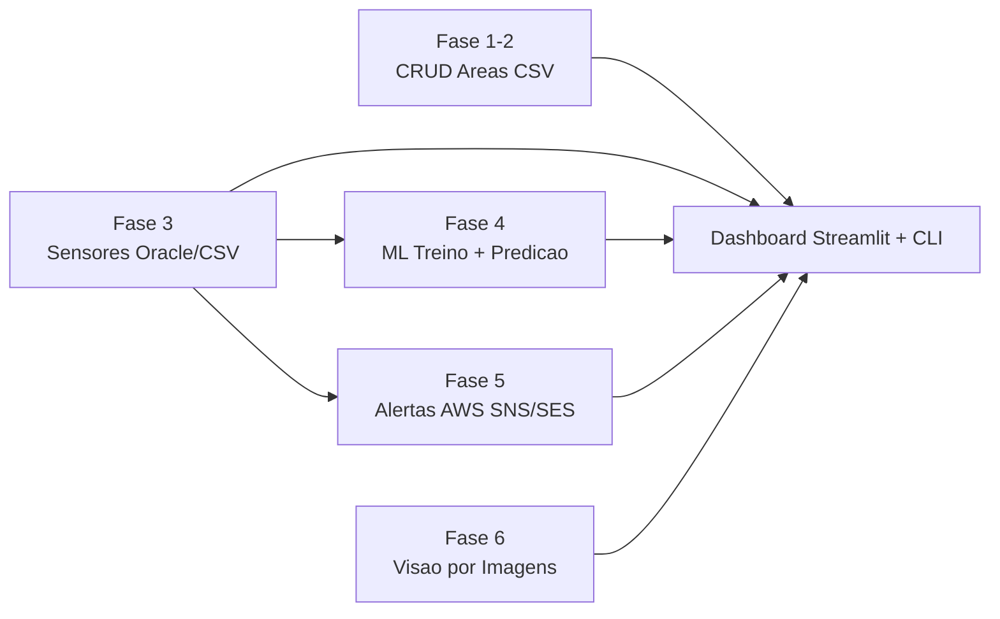
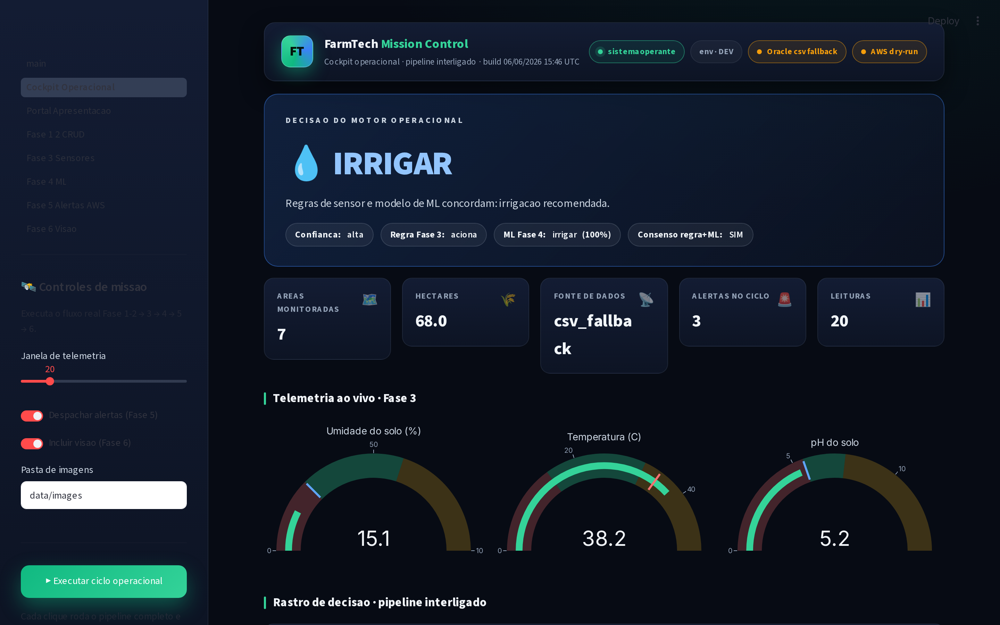
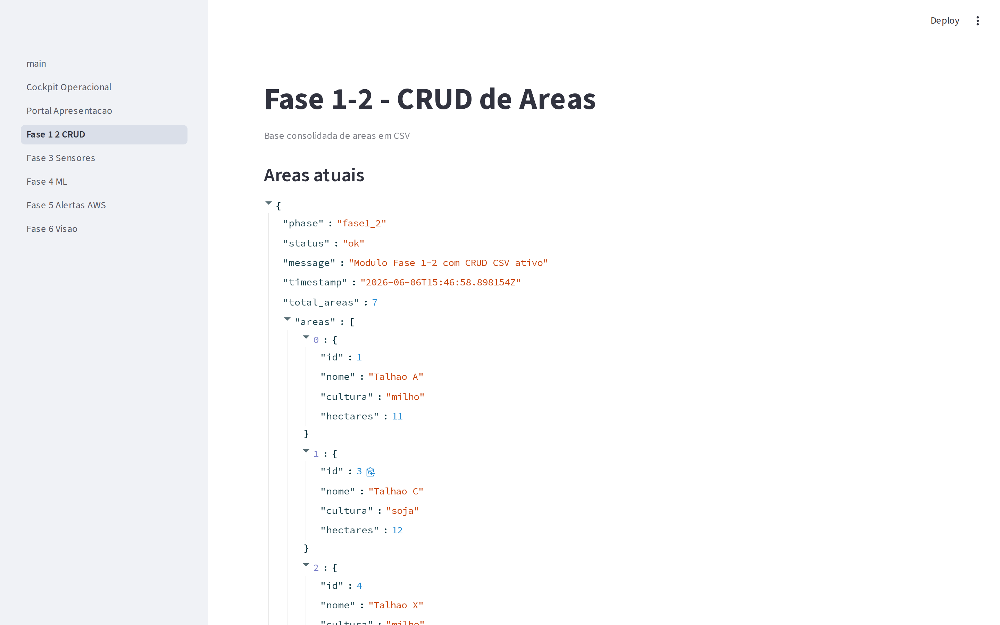
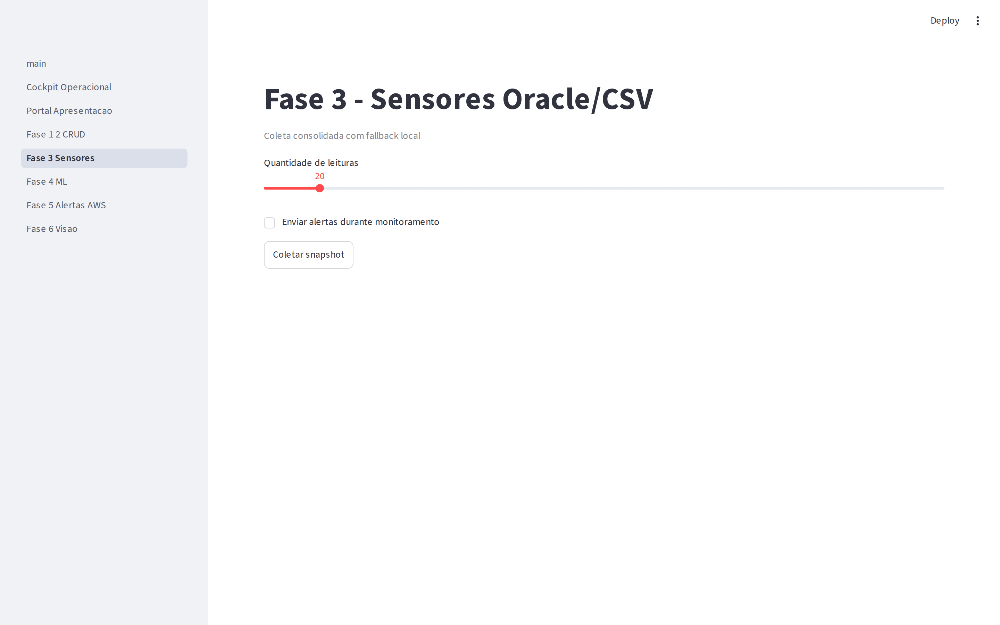
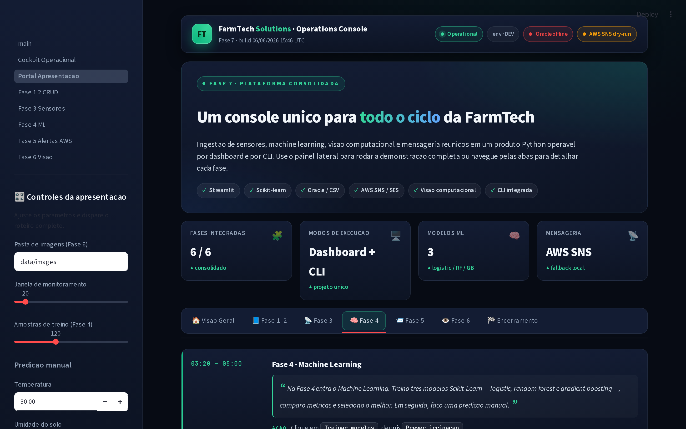
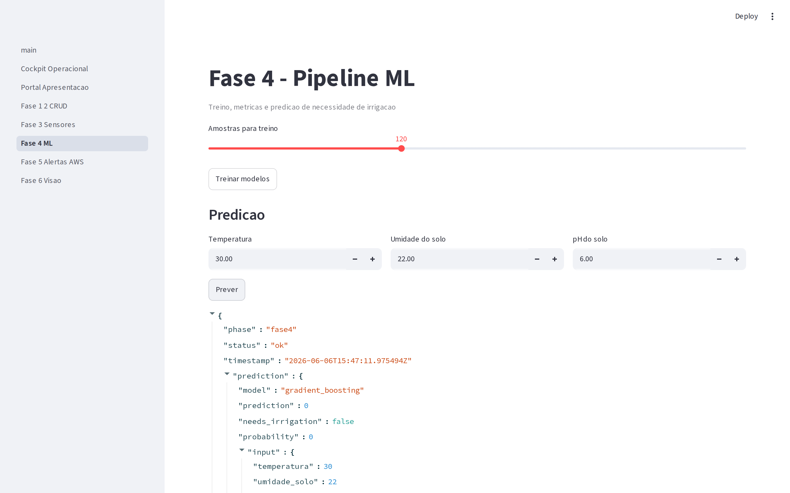
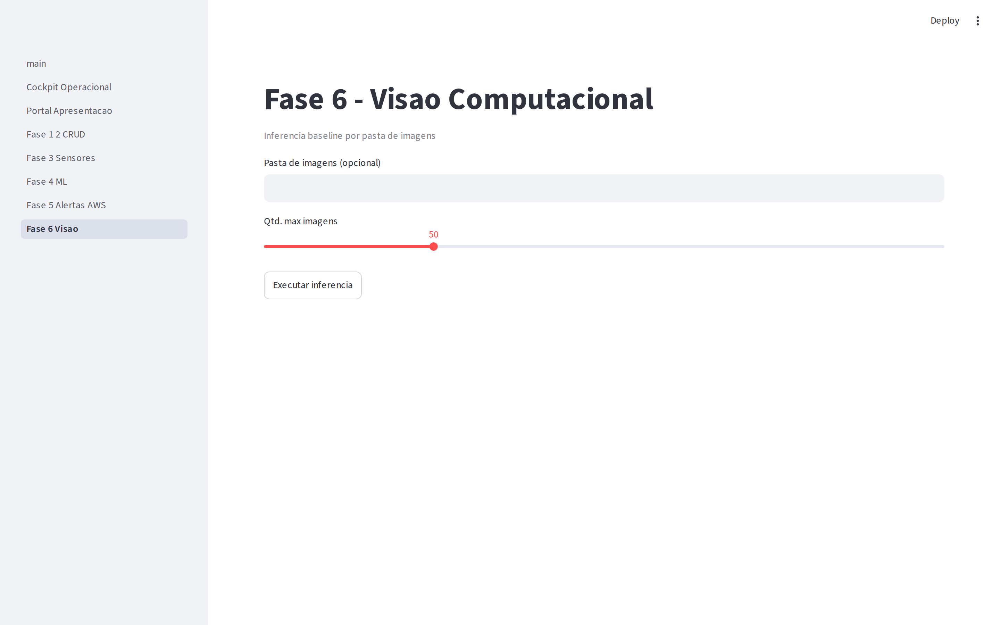

# FIAP - Faculdade de Informática e Administração Paulista

<p align="center">
<a href="https://www.fiap.com.br/"></a>
</p>

<br>

# 🎓 Graduação ON em Inteligência Artificial

## 📚 Repositório Oficial de Projetos e Trabalhos Acadêmicos

### 🌱 FarmTech Solutions — Fase 7 (Cap1 Consolida Sistema)

---

## 👨‍🎓 Integrantes

| Nome | RM | LinkedIn |
|------|-----|----------|
| Cesar Martinho de Azeredo | RM568140 | [](https://www.linkedin.com/in/cesar-azeredo) |
| Carlos Alberto Florindo Costato | RM567005 | [](https://www.linkedin.com/in/carlos-costato/) |
| Phellype Matheus Giacoia Flaibam Massarente | RM566826 | [](https://www.linkedin.com/in/phellype-massarente-13739810a/) |

## 👨‍🏫 Professores

- **Tutor**: Andre Godoy
- **Coordenador**: Ana Cristina dos Santos

---

## 👩🏻‍💻 Sobre este Repositório

Este repositório consolida em uma **única base Python** os entregáveis das fases anteriores da disciplina **Cap1 — FarmTech Solutions**.

Aqui está documentada a evolução técnica, analítica e de engenharia do grupo, contemplando:

- **Fase 1 e 2** — CRUD de áreas, cálculos de insumos e modelagem de dados.
- **Fase 3** — IoT com ESP32, leitura de sensores (temperatura, umidade, pH) e regras de irrigação.
- **Fase 4** — Machine Learning para previsão da necessidade de irrigação.
- **Fase 5** — Cloud / AWS — alertas por SNS / SES quando regras de operação são violadas.

- **Fase 6** — Visão computacional para análise de imagens da plantação.
- Documentação técnica de setup, validação e entrega.
- Evidências para apresentação e vídeo demonstrativo.

A operação é feita por **dashboard Streamlit** (com portal de apresentação) e por **CLI**, garantindo reprodutibilidade total dos experimentos.

Este repositório funciona como um **portfólio técnico estruturado**, evidenciando a integração completa das fases em uma solução única.

---

## 🎯 Objetivo

Entregar uma plataforma única, executável e auditável, que:

- 📌 Integra todos os módulos das fases 1 a 6 em um mesmo workspace.
- 📌 Expõe cada fase tanto pela dashboard quanto pela CLI.
- 📌 Treina e versiona modelos de ML com métricas, ROC, matriz de confusão e cross-validation.
- 📌 Dispara alertas reais (modo AWS) ou em modo *dry-run* local com histórico em JSONL.
- 📌 Permite gravar uma demonstração de até 10 minutos via portal de apresentação dedicado.

---

## 🧠 Estrutura Macro do Repositório

```bash
📂 Cap1_Consolida_sistema
│
├── 📂 app                       # Streamlit principal (dashboard + portal)
│   ├── main.py
│   └── pages/
│       ├── 0_Portal_Apresentacao.py
│       ├── 1_Fase_1_2_CRUD.py
│       ├── 2_Fase_3_Sensores.py
│       ├── 3_Fase_4_ML.py
│       ├── 4_Fase_5_Alertas_AWS.py
│       └── 5_Fase_6_Visao.py
│
├── 📂 phases                    # Modulos por fase (logica de negocio)
│   ├── fase1_2/
│   ├── fase3/
│   ├── fase4/
│   └── fase6/
│
├── 📂 services                  # Orquestracao, healthcheck, alertas
├── 📂 data                      # CSVs, runtime, imagens de teste
├── 📂 references                # Snapshots dos repos originais (fases 1 a 6)
├── 📂 docs                      # Plano, barema, roteiro de video
├── 📂 assets/evidencias         # Prints e evidencias do README
├── 📂 scripts                   # bootstrap.sh, demo_flow.sh
├── 📂 tests                     # Testes (smoke)
│
├── cli.py                       # Comandos de terminal
├── requirements.txt
└── README.md
```

### 🌳 Origem das Fases

| Fase | Tema | Repositório original | Módulo na Fase 7 |
|------|------|-----------------------|------------------|
| 1 e 2 | Áreas, insumos e BD | https://github.com/Phemassa/FarmTechSolutions | [phases/fase1_2](phases/fase1_2) |
| 3 | IoT ESP32 e sensores | https://github.com/Phemassa/fiap-farmtech-fase3 | [phases/fase3](phases/fase3) |
| 4 | ML e Dashboard | https://github.com/Phemassa/fiap-farmtech-fase4 | [phases/fase4](phases/fase4) |
| 5 | Cloud e Alertas AWS | https://github.com/Phemassa/FarmTech-FASE-5-cap1-2026 | [services/alert_service.py](services/alert_service.py) |
| 6 | Visão computacional | https://github.com/Phemassa/Cap_1_Rede_Neural | [phases/fase6](phases/fase6) |

Índice consolidado das referências em [references/README.md](references/README.md).

---

## 🏗️ Arquitetura Consolidada



---

## ⚙️ Setup Rápido

```bash
# 1. Ambiente virtual + dependencias
python -m venv .venv
source .venv/bin/activate
pip install -r requirements.txt

# 2. Variaveis de ambiente (opcional para AWS)
cp .env.example .env

# 3. Dashboard
PYTHONPATH=$PWD streamlit run app/main.py

# 4. CLI
python cli.py health
```

### 📜 Comandos CLI principais

```bash
python cli.py health
python cli.py run fase1_2
python cli.py area-add --nome "Talhao C" --cultura soja --hectares 12
python cli.py area-update --id 1 --hectares 11
python cli.py area-delete --id 2
python cli.py run fase3
python cli.py monitor-fase3 --limit 20 --send-alerts
python cli.py train-fase4 --limit 120
python cli.py predict-fase4 --temperatura 30 --umidade-solo 22 --ph-solo 6
python cli.py run-fase6 --images-dir data/images --limit 20
python cli.py monitor-now --limit 20
python cli.py alerts-history --limit 20
python cli.py alert-test --value 15
```

---

## 📌 Status do Projeto

- ✅ Orquestração híbrida pronta (dashboard + CLI).
- ✅ Fase 1-2 com CRUD de áreas em CSV.
- ✅ Fase 3 com Oracle + fallback CSV e regras operacionais.
- ✅ Fase 4 com treino, métricas (acurácia, F1, ROC, matriz de confusão, CV), predição e modelos persistidos.
- ✅ Fase 5 com SNS/SES + modo *dry-run* + histórico JSONL.
- ✅ Fase 6 com inferência baseline por pasta de imagens.
- ✅ Portal de apresentação dedicado (`app/pages/0_Portal_Apresentacao.py`).
- ✅ Smoke test verde e `scripts/demo_flow.sh` executando todos os fluxos.

---

## 📸 Evidências

Galeria completa em [assets/evidencias/README.md](assets/evidencias/README.md).

### Prints obrigatórios

- [ ] Dashboard Fase 1-2 (CRUD)
- [ ] Dashboard Fase 3 (snapshot)
- [ ] Dashboard Fase 4 (treino, ROC, matriz de confusão)
- [ ] Dashboard Fase 5 (monitoramento e histórico)
- [ ] Dashboard Fase 6 (inferência)
- [ ] AWS SNS topic + subscription
- [ ] E-mail de alerta recebido

### Galeria

#### Portal de Apresentação


#### Fase 1-2 — CRUD


#### Fase 3 — Sensores


#### Fase 4 — Treino & Métricas


#### Fase 4 — Predição


#### Fase 5 — SNS Topic


#### Fase 5 — E-mail recebido


#### Fase 6 — Inferência


---

## 🎬 Vídeo Demonstrativo

[](https://youtu.be/SEU_LINK_AQUI)

**Link direto**: https://youtu.be/SEU_LINK_AQUI

Comandos usados na gravação:

```bash
./scripts/demo_flow.sh
```

---

## 📚 Documentação Auxiliar

- 📋 Checklist de barema: [docs/BAREMA_CHECKLIST.md](docs/BAREMA_CHECKLIST.md)
- 🎥 Roteiro de vídeo: [docs/VIDEO_SCRIPT_10MIN.md](docs/VIDEO_SCRIPT_10MIN.md)
- 🧾 Template de evidências: [docs/EVIDENCIAS_ENTREGA.md](docs/EVIDENCIAS_ENTREGA.md)
- ☁️ Setup AWS: [docs/AWS_ALERT_SETUP.md](docs/AWS_ALERT_SETUP.md)
- 🗺️ Plano de projeto: [docs/PROJECT_PLAN.md](docs/PROJECT_PLAN.md)

---

## 📋 Licença


<p xmlns:cc="http://creativecommons.org/ns#" xmlns:dct="http://purl.org/dc/terms/"><a property="dct:title" rel="cc:attributionURL" href="https://github.com/Phemassa/Cap1_Consolida_sistema">FarmTech Solutions — Fase 7</a> por <a rel="cc:attributionURL dct:creator" property="cc:attributionName" href="https://fiap.com.br">FIAP</a> está licenciado sobre <a href="http://creativecommons.org/licenses/by/4.0/?ref=chooser-v1" target="_blank" rel="license noopener noreferrer" style="display:inline-block;">Attribution 4.0 International</a>.</p>
