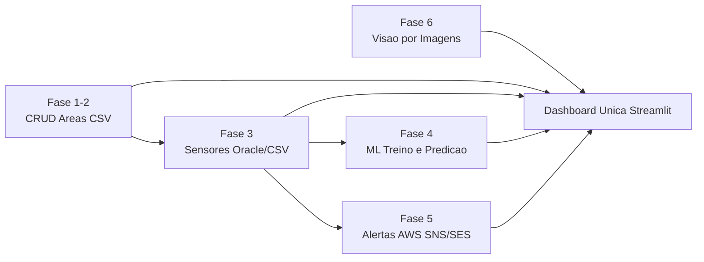

# Cap1 Consolida Sistema - Fase 7

Projeto consolidado da Fase 7 para integrar as fases 1 a 6 em uma base unica Python, com operacao por dashboard e por CLI.

## Objetivo

- Integrar modulos das fases 1, 2, 3, 4 e 6.
- Usar dashboard central para acionar servicos.
- Disponibilizar comandos de terminal equivalentes.
- Disparar alertas AWS por e-mail com base em sensores da Fase 3.

## Estrutura

```text
Cap1_Consolida_sistema/
  assets/evidencias/       # Prints e evidencias para README
  app/                     # Streamlit principal e configuracoes
    pages/                 # Paginas separadas por fase
  phases/                  # Modulos por fase
    fase1_2/
    fase3/
    fase4/
    fase6/
  services/                # Orquestracao, health check e alertas
  docs/                    # Documentacao e planejamento
  tests/                   # Testes
  cli.py                   # Comandos de terminal
```

## Arquitetura consolidada



## Setup rapido

1. Criar ambiente virtual e instalar dependencias:

```bash
python -m venv .venv
source .venv/bin/activate
pip install -r requirements.txt
```

2. Configurar variaveis:

```bash
cp .env.example .env
```

3. Executar dashboard:

```bash
streamlit run app/main.py
```

4. Executar CLI:

```bash
python cli.py health
python cli.py run fase1_2
python cli.py area-add --nome "Talhao C" --cultura soja --hectares 12
python cli.py area-update --id 1 --hectares 11
python cli.py area-delete --id 2
python cli.py run fase3
python cli.py monitor-fase3 --limit 20
python cli.py monitor-fase3 --limit 20 --send-alerts
python cli.py train-fase4 --limit 120
python cli.py predict-fase4 --temperatura 30 --umidade-solo 22 --ph-solo 6
python cli.py run-fase6 --images-dir data/images --limit 20
python cli.py monitor-now --limit 20
python cli.py alerts-history --limit 20
python cli.py alert-test --value 15
```

## Status atual

- Scaffold de consolidacao criado.
- Orquestracao hibrida inicial pronta (dashboard + CLI).
- Fase 1-2 com CRUD de areas em CSV integrado na CLI.
- Fase 3 com Oracle + fallback CSV e regras de alerta operacional implementada.
- Fase 4 com treino de modelos, metricas e predicao inicial integrada.
- Fase 6 com inferencia baseline por pasta de imagens integrada no app e CLI.
- Fase 5 com monitoramento pontual + historico de alertas integrado.

## Paginas da dashboard

- Home: [app/main.py](app/main.py)
- Fase 1-2: [app/pages/1_Fase_1_2_CRUD.py](app/pages/1_Fase_1_2_CRUD.py)
- Fase 3: [app/pages/2_Fase_3_Sensores.py](app/pages/2_Fase_3_Sensores.py)
- Fase 4: [app/pages/3_Fase_4_ML.py](app/pages/3_Fase_4_ML.py)
- Fase 5: [app/pages/4_Fase_5_Alertas_AWS.py](app/pages/4_Fase_5_Alertas_AWS.py)
- Fase 6: [app/pages/5_Fase_6_Visao.py](app/pages/5_Fase_6_Visao.py)

## AWS Alerts

Guia completo de configuracao e evidencias: ver [docs/AWS_ALERT_SETUP.md](docs/AWS_ALERT_SETUP.md).

## Fechamento de entrega

- Checklist de barema: [docs/BAREMA_CHECKLIST.md](docs/BAREMA_CHECKLIST.md)
- Roteiro de video (10 min): [docs/VIDEO_SCRIPT_10MIN.md](docs/VIDEO_SCRIPT_10MIN.md)
- Template de evidencias: [docs/EVIDENCIAS_ENTREGA.md](docs/EVIDENCIAS_ENTREGA.md)
- Script de demonstracao CLI: [scripts/demo_flow.sh](scripts/demo_flow.sh)

## Evidencias no README (preencher)

Use as imagens em [assets/evidencias/README.md](assets/evidencias/README.md) e atualize esta secao antes da entrega.

### Prints obrigatorios

- [ ] Dashboard Fase 1-2 (CRUD)
- [ ] Dashboard Fase 3 (snapshot)
- [ ] Dashboard Fase 4 (treino e predicao)
- [ ] Dashboard Fase 5 (monitoramento e historico)
- [ ] Dashboard Fase 6 (inferencia)
- [ ] AWS SNS topic + subscription
- [ ] E-mail de alerta recebido

### Video demonstrativo

- Link YouTube (nao listado): PENDENTE

### Comandos usados na gravacao

```bash
./scripts/demo_flow.sh
```
